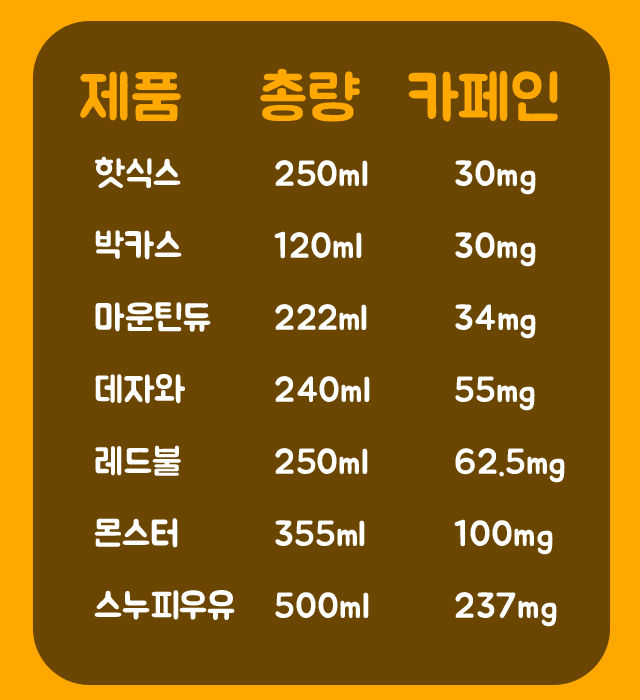

# tejava
## 데자와란?
동아오츠카에서 판매하는 프리미엄 밀크티를 표방한 미묘한 맛의 공대생 미법포션음료수. 1997년 7월에 처음 출시되었다.홍차음료 '데자와' 출시(1997.07.04. 매일경제신문)컬트적인 인기로 유명하다. 미묘하게 맛이 없어지고 미묘하게 더 양이 많고 더욱 비싸진 병입 제품인 데자와 프리미엄이라는 음료도 존재한다.[2]

## 데자와의 나이?
## 데자와의 경쟁 제품
### 실론티 
## 데자와의 카페인 함량

